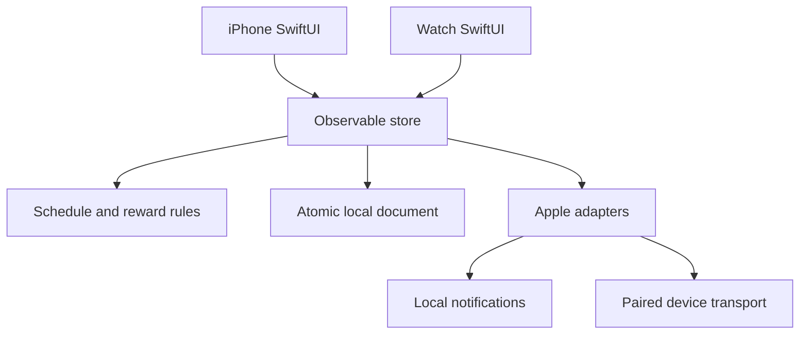

# Architecture and product decisions — implementation 0.1

## Accepted direction

Phone setup + simple watch interaction; one round fern woodland spirit and its forest; gentle persistence without loss of earned growth; customizable timing and activities; internal TestFlight later; no deployment now. Character is cozy while idle and enthusiastic after a completed snack. Mossling/Moss are editable working names.

## Defaults chosen to unblock implementation

- Monday–Friday 09:00–17:00, fixed wall-clock cadence of 60 minutes. Settings offer 60/90/120 minutes, selected weekdays, and a same-day start/end window. No overnight windows yet.
- The active window's end is exclusive. An opportunity expires at the next valid slot or at quiet hours. No future completion, catch-up queue, or automatic timer completion.
- Equal rewards for all enabled activities. Duration requires elapsed target + explicit confirmation; repetitions require explicit confirmation. No inference from sensors.
- 10 growth for a unique scheduled local date/hour. Three stages at 0/30/150 growth; fern/mushrooms/pond at 10/50/100. These are explicit version-1 tuning constants, not user-customized difficulty.
- Rotation among enabled activities is deterministic across devices and launches. User may choose another enabled activity when starting. Sessions carry snapshots, so editing an activity never changes an already-started session.
- Up to 56 recurring reminder requests; capacity is validated rather than silently truncating. Eight request slots are reserved for one-shot snoozes. Ten-minute snooze cannot extend beyond the opportunity.
- Phone owns reminders; Watch relies on Apple's notification routing and cached app state. Watch can save a completed session offline. Independent watch reminders are deferred.

## Components

One repository, two native app targets, one local Swift package. Swift 6 strict concurrency; iOS18/watchOS11 deployment floors. UI changes and document mutations are main-actor serialized. Document I/O is synchronous and deliberately small; background transport callbacks extract Sendable values before crossing onto the main actor. No third-party runtime dependencies.

## Durable transaction boundary

DocumentController creates a candidate from its last committed document. A mutation is applied and validated, then FileDocumentRepository atomically replaces the file. Only a successful write publishes the candidate. The store mirrors that committed document into Observation state. No await exists inside the transaction, so concurrent UI/sync changes cannot interleave halfway through a write.

A completed session inserts a CompletionEvent and pendingEventID and clears the active session in one write. Only after commit does UI celebrate or transport enqueue. A received batch is validated in full, merged and persisted, then acknowledged. ACK receipt removes a delivery obligation; it never deletes history. Write failures preserve prior memory/disk state and pending retries. Platform keyframes do not drive application state or growth.

Atomic JSON is appropriate to a small household ledger. The repository protocol permits a future database without changing behavior. Avoid introducing derived mutable XP totals: progression is computed from unique reward keys. Whole-file writes become a performance concern only at a much larger ledger; measure before changing the transaction model.

## Identity, calendars and timers

Calendar inputs are explicit in the domain and normalized to Gregorian while retaining time zone. Slot identity is local day + scheduled minute; reward identity is local day + scheduled hour, independent of config revision. Missing DST local times are skipped; repeated times select the first occurrence. Travel follows each device's current local clock and does not rewrite existing event identities. The hourly reward cap deliberately avoids duplicate fall-back/travel-hour credit; it is not an anti-cheat system.

A live session snapshots its opportunity and activity. Elapsed time is accumulated paused duration plus the interval from its persisted runningSince, so app suspension does not reset it. Date-based elapsed time can reflect a manual system-clock change; monotonic cross-reboot timing is out of scope. Store refuses a duration start that cannot finish before expiry; expired sessions explain why completion is no longer available and can be closed.

## Synchronization

ConfigurationSnapshot uses application context: small, phone-owned, replaceable latest state. An installation authority UUID plus revision prevents an old settings packet rolling back the current phone. A new installation can supersede a previous high revision; retired authority IDs are persisted to ignore delayed packets.

SyncPacket uses user-info transfer both directions for immutable events, application ACKs and inventory requests. Actual encoded payloads are capped at48KiB, with at most25 events per batch. The sender's durable outbox survives transport failures and process restarts. The OS queue is an optimization, not the durable source of truth.

On activation/reachability, each device sends pending events and an inventory digest. A mismatch triggers bounded history batches. This intentionally simple full-history reconciliation is acceptable for a small ledger; it avoids a fragile distributed cursor. A large multi-year history would benefit from page/range reconciliation. Inventory FNV digest is diagnostic, not cryptographic.

Foreground/open/reconnect synchronization is the MVP acceptance target. Automatic delivery during a cold background watch launch remains a hardware/lifecycle verification item. No continuous background process is assumed. Reopening the apps reactivates transport and retries pending data.

## Notification semantics

UNCalendarNotificationTrigger owns repeating local reminders. Their text is generic, independent of runtime exercise assignment. Reminder actions bring the phone to Forest or snooze an active opportunity; they never complete exercise. Permission absent/denied is normal user state, not a first-launch failure.

All OS reminder mutations are queued serially in the store. Completion removes delivered alerts and one-shot snoozes only; it cannot remove a weekly repeating request. Configuration reconciliation removes obsolete requests and adds desired requests. Apple's notification center has no atomic replace transaction: partial failure surfaces a retryable message and is reconciled on reopening. Unchanged schedules retain snoozes.

Focus, notification permissions, wrist/phone routing, and DST behavior of Apple's scheduler affect delivery. Domain tests establish slot calculations, not system notification delivery guarantees. Physical acceptance explicitly covers these boundaries.

## Recovery and evolution

Schema1 is the first unreleased save format. Unknown/newer schema or corrupt data causes a blocking recoverable error and preserves bytes. No automatic reset. JSON export plus non-destructive progress merge offers recovery without replacing current settings/installation identity. Merge is idempotent; newly recovered events are queued for peer delivery.

A restored whole-device backup can restore an older authority/revision; a future explicit pairing reset/migration flow is needed for every such case. This is documented, not silently worked around by accepting stale settings.

Before shipping schema2, add migration fixtures and preserve originals on conversion failure. Before adding currencies, reward rules need versioned grants or an explicit historical recalculation policy. Current rule version1 is encoded in progression and must not be changed casually.

## Later extensions with clear boundaries

- New artwork/species changes presentation catalogs, not event history.
- More complex schedules require notification capacity strategy and domain fixtures.
- A started-session grace period belongs in completion rules, not UI timer exceptions.
- HealthKit or rep verification would produce explicit completion evidence; never infer it from a finished timer.
- Cloud backup is distinct from paired-device transport and must preserve identity/recovery semantics.
- Screen Time blocking adds entitlement and policy work and is not part of this gentle MVP.

## Product delivery slices (September 2026)

Build these as separate reviewable PRs, preserving ordinary commits within each PR:

1. **Everyday snack loop:** explicit skip, pause through the next local midnight, resume, five-minute finishing grace for sessions started in their original window, schema migration, and real completion/relaunch UI acceptance.
2. **A forest worth returning to:** keep existing earned stages and decorations; extend milestones over weeks, one persistent companion, reversible Sunlit/Moonlit appearance, milestone-specific celebrations, shared progression definitions.
3. **A varied activity rotation:** deterministic balanced suggestions shared by phone/watch, preserving immutable session activity snapshots and user choice.

Product defaults: one companion; permanent growth; no debt or decay; self-confirmed activity; gentle reminders. Multiple creatures, automatic sensing, and configurable repeated nudging remain separate future decisions.

### Everyday-loop rules

- Phone settings own temporary routine overrides; Watch applies them after receiving a newer configuration. Offline Watch completion remains valid even if the phone skipped or paused that opportunity. Completion wins for rewards; the immutable ledger still grants one reward per hour key.
- Skip applies to the current reward key until the next local midnight. Pause uses an absolute deadline computed from the local calendar at the time of the action; travel does not extend it. Resume clears the pause while retaining skips.
- Neither action cancels a snack already underway. A validated new session may finish before its original expiry plus five minutes; start must still precede original expiry. Legacy sessions keep their original deadline. Timer pause does not extend the deadline.
- Save schema 2 explicitly migrates schema 1 in memory and writes the new version at the next successful atomic save. Unknown versions and invalid documents are preserved and rejected.
- Dated local notifications cover up to seven calendar days, with 56 scheduled slots and eight reserved snoozes. Foreground entry, settings changes, and completion replenish the horizon. Pausing today retains tomorrow's already prepared reminders without relying on background execution. Coverage is shown only after successful scheduling; failures stay visible. After travel, reopen the app to replan in the new local timezone.
- Phone and Watch should be updated together. Configuration snapshots now use protocol version 2; old apps reject them until updated. Schema-1 migration marks the Watch cache for refresh while preserving its phone authority and earned history. No background-only synchronization guarantee is added here.

The finite notification horizon deliberately replaces indefinite weekly repeats: Apple's repeating calendar triggers cannot omit a single occurrence. See [Apple's scheduling model](https://developer.apple.com/library/archive/documentation/NetworkingInternet/Conceptual/RemoteNotificationsPG/SchedulingandHandlingLocalNotifications.html). Hardware acceptance must exercise pause while closed, next-day resumption, permission revocation, travel, and offline Watch reconciliation.

### Balanced suggestions

Suggestions are a daily cyclic rotation through enabled activity IDs, starting at a stable day-specific offset. Phone and Watch derive the same suggestion from the same configuration without waiting for completion-history sync. All enabled activities appear before repetition within that day's schedule, and counts differ by at most one. Missing DST slots do not consume a rotation position. Choosing another activity never rewrites an existing session snapshot or changes later suggestions. This is a variety rule, not exercise personalization by equipment, ability, or recovery.
